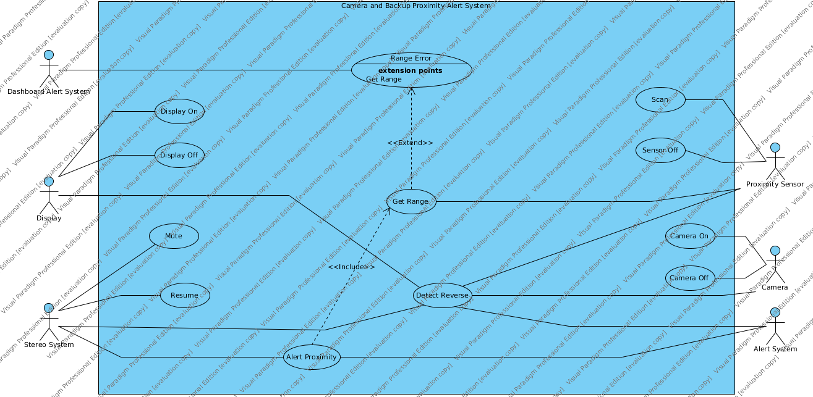

---
title: Automotive Backup Rollover Prevention System Requirements
author: 
- name: Rayshawn Holbrook, Erin Hoffman, & Camille Welcher
  affiliation: Michigan State University
date: Feb 9, 2015
abstract: |
    The proposed system will aid vehicle operators in the ability to detect nearby objects while operating the vehicle in reverse. The field of view is dangerously limited while backing up. Thus, the risk of collision with nearby objects is dramatically increased. Such collisions can cause considerable property and liability damages. More importantly, serious injury (often death) can occur when the vehicle comes in contact with humans. This system will take advantage of sonar parking sensors for detecting the distance of nearby objects, and provide in-vehicle audio alerts that vary in intensity based on the distance between the vehicle and the closest nearby object. In addition to the detection and alert functionality, a rear facing backup camera is included to provide additional visibility into the area behind the vehicle. This video feed is displayed via a rear-view mirror monitor, for easy observation. The Backup Rollover Prevention (BRP) system will be expected to be used in "normal" low-speed driving and parking situations. It will not be expected to function during operation over 15 km/h, nor will it be installed in vehicles used for activities such as racing. We also will not expect it to be used in fleet vehicles (police or fire) where reliable close-quarters operation can be critical.

...

# Requirements

## Functional Requirements

Operating requirements and performance requirements dictate that components be consistent with existing automotive architecture, so the various controllers are therefore required to be Electronic Control Units (ECUs) connected over a Controller Area Network (CAN) bus.  ECUs are embedded computers within modern automobiles [@her_component-based_2007].  They are essentially microcontrollers connected with inputs and outputs.  ECUs broadcast messages over the CAN, bus, which will serve as the network in our system.  For the sake of simplicity, the controller associated with each sensor or output will be referred to as an individual ECU.

1. Proximity Alert System
    a. A gear shift ECU to sense when the vehicle is in reverse and broadcast a message
    b. A rear-facing sensor using sonar or similar technology to detect objects in a known field of view
        i. If one sensor is insufficient, multiple sensors are used
        ii. The field of view is bounded by the defined ranges
    c. An ECU to control the sensor (1.b) and process inputs
        i. Listens for a message from the gear shift ECU (1.a) that the vehicle is in reverse
        ii. If the vehicle is detected to be in reverse, the sensor (1.b) should be turned on; else, it should be turned off
        iii. When the sensor (1.b) is on, compute the distance to the nearest object and place it into one of ranges 1, 2, 3, 4, or 5
        iv. If the sensor indicates range 1,2,3, or 4, broadcast a message indicating the stereo system to mute and a message for the audio alert system ECU (1d.) telling what range level was detected
        v. If the sensor indicates range level 5, broadcast a message for the stereo system to resume previous volume and for the alert system to cease sounding
        vi. If the gear shift ECU (1.a) indicates the vehicle is no longer in reverse, repeat the behavior of 1.a.v
    d. An audio alert system to produce sounds (using existing alert system)
    e. Audio alert system ECU
	    i. Should listen for updates from the backup proximity sensor ECU (1.c)
	    ii. If 1.c sends a range 1 message, sound the alert continuously
	    iii. If 1.c sends a range 2 message, sound an alert for 0.2 seconds every 0.4 seconds
	    iv. If 1.c sends a range 3 message, sound an alert for 0.2 seconds every 0.8 seconds
	    v. If 1.c sends a range 4 message, sound an alert for 0.2 seconds every 1.0 seconds
	    vi. The ECU shall contain an interval timer so that the sound pattern will not restart when a duplicate range message is received
    f. A stereo system (if available)
    g. A stereo system ECU
        i. Should listen for updates from the backup proximity sensor ECU (1.c)
        ii. If this ECU receives a mute message, it should store the current volume and reduce the volume to 0
        iii. If this ECU receives a resume message, it should restore the volume to its previously stored level
        iv. This this ECU receives a resume message and is not currently muted, it should ignore it

2. Camera System
    a. A camera sensor, consisting of a digital video camera, facing the rear, viewing ranges 1 to 4
    b. A camera sensor ECU
        i. The camera sensor ECU should listen for a message from the gear shift ECU (1.a) indicating the vehicle is in reverse
        ii. If the vehicle is in reverse, the camera should be initiated
        iii. The video information should be converted to the appropriate packet format and streamed across the CAN bus
        iv. When the vehicle is not in reverse (1.a), the camera should be turned off
    c. A video display, integrated into the rear-view mirror
    d. A video display ECU
        i. The ECU should listen for a message from the gear shift ECU (1.a) that the vehicle is in reverse
        ii. If the vehicle is in reverse, the display should be initiated, the this ECU should begin listening for data from the camera sensor ECU (2.b.iii)
        iii. When video packets are received, convert them to the proper display format and put them on the screen
        iv. When the vehicle is not in reverse, turn the display off

## Nonfunctional Requirements

We choose 4 meters as our maximum distance (3.iv) based on the results of Paine and Henderson [@paine_devices_2001]. A false positive is when the system sounds an alert with no obstacle in range. A false negative is when the system fails to sound an alert when an obstacle is anywhere with the alert range. With reversing shown to be a considerable risk to pedestrians, it is important that these systems be fault tolerant, but also that they operate with reasonable and understood limitations. False negatives are unacceptable, but we still aim to reduce false positives in an effort to avoid drivers adapting to alert messages and ignoring them (see 3.e).

It is important that we expect a reasonable level of efficacy, and not give operators the impression that their proximity sensors are fool-proof. Experimentation showed that at 8kph, the speeds at which most backup collisions occur [@young_development_1995], most sonar systems designed for parking could only be expected to prevent 25% of collisions [@glazduri_investigation_2005]. Given the age of this study, and that the sensors were placed for parking and not pedestrian detection, we require our system to achieve a 50% prevent rate under the same laboratory conditions (3.g). While this will be an improvement over the previously tested systems, the still-low level of efficacy supports our also including rear cameras.

3. Ranges and tolerances for the Proximity Alert System (1)
    a. Ranges are measured from the rear bumper of the car, facing backward, perpendicular to the bumper
        i. Range 1 shall be distance 0 to 1 meter
        ii. Range 2 shall be distance 1 to 2 meters
        iii. Range 3 shall be distance 2 to 3 meters
        iv. Range 4 shall be distance 3 to 4 meters
        v. Range 5 shall be distances beyond 4 meters
    b. Ranges can be transmitted over network with less than 0.1 seconds of delay
    c. All states emitted by the proximity ECU (1.c) shall be subject to error correcting codes
    d. Any message received by the alert system ECU (1.e) which is outside of the acceptable ranges shall result in a dashboard error notification
    e. Any message received by the alert system ECU (1.e) in range 1 or 2 shall result in an alert, regardless of error state
    f. Proximity sensor response times shall be less than 350ms, as dictated by ISO standards [@iso_transport]. 
    g. Proximity sensor collision prevention probability shall be at least 0.5 under laboratory conditions

An important consideration for the camera system is the acceptable lag between shifting into reverse and activation of the view-screen. Manufacturer comments during NHTSA proceedings suggest reasonable times of 1 to 3 seconds [@nhtsa_rearview] (4.a).

4. Tolerances for the camera system
    a. We require a maximum 1 second delay between shifting and view-screen activation 
    b. Minimum average mean time between failures for camera subsystem activation shall be 3 years in a well-functioning system

# Use Cases    

## System Invariants

1. Permit operation of the vehicle (if the backup rollover system prevents the vehicle from backing up or driving at the speed limit, then it is not useful)

2. Prohibit malicious modifications (if a hacker can alter the backup rollover system so it fails to give an alarm, or falsely gives an alarm, then the system isn’t trustworthy)

3. Prohibit any system within the vehicle from turning off the backup rollover system (for example, a third-party stereo system should not disable our system)

## System Boundary

The boundary of our system encompasses the backup proximity system, camera system, and their connections to the built-in car systems.

## Detailed Use Cases

1. Alert Proximity

    Actors

    :   Alert System, Stereo System

    Description

    :    This use case is designed for alerting the driver whether or not an object is detected in range of the back of the vehicle.  The alert system connects to this use case in order to find out when an alert needs to be sounded.  The stereo system connects to this use case in order to find out when to turn off, so the driver will be more likely to hear the alert noise.  It includes the “get range” use case which determines how far away the object is.  Use cases “mute” and “resume” are dependent on this use case because the status of whether or not an alert is happening needs to be known before the alert sounds or turns off.

    Type

    :   Primary

    Includes

    :   Get Range

    Extends

    :   None

    Cross-refs

    :   1.c, 1.d, 1.e, 1.f, 1.g

    Use Cases

    :   Mute, Resume

2. Display Off 

    Actors

    :    Display
 
    Description

    :    This use case is when the display needs to turn off.  It is connected to the display actor and performs the necessary logic to turn off the screen when it needs to be turned off.  It depends on the “detect reverse” and “camera off” use cases, since the display should only turn off if the vehicle is not in reverse and the camera is turned off.

    Type

    :   Secondary

    Includes

    :   None

    Extends

    :   None

    Cross-refs

    :   2.c, 2.d

    Use Cases

    :   None

3. Display On 

    Actors

    :    Display
 
    Description

    :    This use case is when the display needs to turn on.  It is connected to the display actor and performs the necessary logic to turn on the screen when it needs to be turned on.  It depends on the “detect reverse” and “camera on” use cases, since the display should only turn on if the vehicle is in reverse and the camera is turned on.

    Type

    :   Secondary

    Includes

    :   None

    Extends

    :   None

    Cross-refs

    :   2.c, 2.d

    Use Cases

    :   None

4. Mute

    Actors

    :    Stereo System
 
    Description

    :   This use case is when the stereo needs to mute.  It is connected to the stereo system actor and performs the necessary logic to mute the sound from the stereo system when it needs to be muted.  It depends on the “detect reverse” and “alert proximity” use cases, since the stereo should only be muted when the vehicle is in reverse and the proximity of an object has been detected and calculated by the sensor and range calculations. 

    Type

    :   Secondary

    Includes

    :   None

    Extends

    :   None

    Cross-refs

    :   1.f, 1.g

    Use Cases

    :   None

5. Resume

    Actors

    :    Stereo System
 
    Description

    :    This use case is when the stereo needs to resume playing.  It is connected to the stereo system actor and performs the necessary logic to resume playing sound from the stereo system if it had been playing before it was muted.  It depends on the “alert proximity” use case, since the stereo should only resume playing when there is no object detected within a dangerous proximity.

    Type

    :   Secondary

    Includes

    :   None

    Extends

    :   None

    Cross-refs

    :   1.g, 1.f

    Use Cases

    :   

6. Scan

    Actors

    :    Proximity Sensor
 
    Description

    :    Turns on the proximity sensor and scans for nearby objects when the vehicle is put into reverse, making the data available on the CAN bus.

    Type

    :   Primary

    Includes

    :   None

    Extends

    :   None

    Cross-refs

    :   1.b.i, 1.b.ii, 1.c.i, 1.c.ii, 1.c.iii, 1.c.iv, 1.c.v

    Use Cases

    :   Get Range, Alert Proximity

7. Sensor Off

    Actors

    :    Proximity Sensor
 
    Description

    :    Turn the proximity sensor off when the vehicle is detected to be in reverse

    Type

    :   Secondary

    Includes

    :   None

    Extends

    :   None

    Cross-refs

    :   1.c.vi

    Use Cases

    :   Alert Proximity

8. Detect Reverse

    Actors

    :    Alert System, Display, Stereo System, Camera, Proximity Sensor
 
    Description

    :    Detects whether the vehicle has been put into reverse by the driver and broadcasts this message over the CAN bus within determined time tolerance.

    Type

    :   Primary

    Includes

    :   None

    Extends

    :   None

    Cross-refs

    :   1.a, 1.c.i, 1.c.vi, 2.b.i, 2.b.iv, 2.d.ii, 2.d.iv, 4.a

    Use Cases

    :   

9. Camera On

    Actors

    :    Camera
 
    Description

    :    Turns the camera on when the vehicle is in reverse

    Type

    :   Primary

    Includes

    :   None

    Extends

    :   None

    Cross-refs

    :   4.b, 2.b, 2.a

    Use Cases

    :   Display On

10. Camera Off

    Actors

    :    Camera
 
    Description

    :    Turns the camera off when the vehicle is in reverse

    Type

    :   Secondary

    Includes

    :   None

    Extends

    :   None

    Cross-refs

    :   4.b, 2.d.iv

    Use Cases

    :   None

11. Get Range

    Actors

    :    Proximity Sensor

    Description

    :    This use case determines the distance range of any objects detected by the proximity sensor.  It is connected to the proximity sensor, when collects raw sensor data that needs to be converted into a distance range.  It depends on the “scan” use case, since no distance ranges can be calculated unless the proximity sensor has scanned for objects.

    Type

    :   Primary

    Includes

    :   None

    Extends

    :   None

    Cross-refs

    :   1.a, 1.b, 1.c

    Use Cases

    :   Alert Proximity, Range Error

12. Range Error

    Actors

    :    Dashboard Alert System
 
    Description

    :   This use case is a special case (error case) of the “get range” use case.  It happens when there is an error in determining the range of objects detected by the proximity sensor.  It communicates with the dashboard alert system actor to inform the driver when an error occurs to the driver knows that the system is not reliably reporting

    Type

    :   Secondary
    
    Includes

    :   None

    Extends

    :   None

    Cross-refs

    :   1.c.*

    Use Cases

    :   None

## Use Cases Diagram

## Sources of Uncertainty

Sonar range detectors work by bouncing ultrasonic pulses off of surrounding surfaces. The distance between the sensor and the surface another object is measured using the time-of-flight for the ultrasonic pulse. Problems arise when the ultrasonic pulse doesn’t bounce off of an object as expected. In these situations, distance measurements for the objects may be incorrect, or worse, not calculated at all. The following are examples of such situation.

### Specular Reflection

Some surfaces will reflect the sonar pulse away from the sensor, at certain angles. In this case the sensor is never able to calculate the time-of-flight for the pulse because the pulse is not returned. Therefore, no distance measurement can be calculated.

### Signal Absorption  

Softer materials are have the ability to absorb the ultrasonic pulse. When this occurs, the returned signal strength significantly reduced. This could cause objects to go undetected until they are too close to the vehicle to avoid collision.  

### Downhill Objects

 When backing downhill, object may be closer than the sonar reading reflects. This is a result of the increase time-of-flight caused by the decline.

## References
\setlength{\parindent}{-0.2in}
\setlength{\leftskip}{0.2in}
\setlength{\parskip}{8pt}
\vspace*{-0.2in}
\noindent
