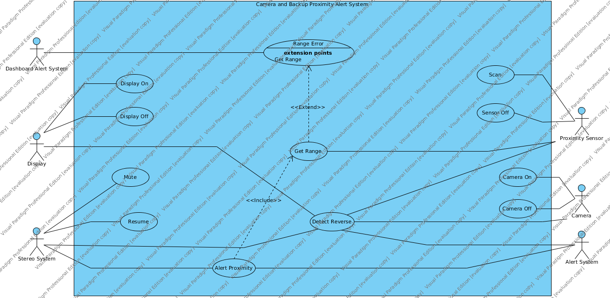

---
title: Automotive Backup Rollover Prevention System Use Cases
author: 
- name: Rayshawn Holbrook, Erin Hoffman, & Camille Welcher
  affiliation: Michigan State University
date: Feb 24, 2015
...

## System Invariants

1. Permit operation of the vehicle (if the backup rollover system prevents the vehicle from backing up or driving at the speed limit, then it is not useful)

2. Prohibit malicious modifications (if a hacker can alter the backup rollover system so it fails to give an alarm, or falsely gives an alarm, then the system isn’t trustworthy)

3. Prohibit any system within the vehicle from turning off the backup rollover system (for example, a third-party stereo system should not disable our system)

## System Boundary

The boundary of our system encompasses the backup proximity system, camera system, and their connections to the built-in car systems.

## Detailed Use Cases

1. Alert Proximity

    Actors

    :   Alert System, Stereo System

    Description

    :    This use case is designed for alerting the driver whether or not an object is detected in range of the back of the vehicle.  The alert system connects to this use case in order to find out when an alert needs to be sounded.  The stereo system connects to this use case in order to find out when to turn off, so the driver will be more likely to hear the alert noise.  It includes the “get range” use case which determines how far away the object is.  Use cases “mute” and “resume” are dependent on this use case because the status of whether or not an alert is happening needs to be known before the alert sounds or turns off.

    Type

    :   Primary

    Includes

    :   Get Range

    Extends

    :   None

    Cross-refs

    :   1.c, 1.d, 1.e, 1.f, 1.g

    Use Cases

    :   Mute, Resume

2. Display Off 

    Actors

    :    Display
 
    Description

    :    This use case is when the display needs to turn off.  It is connected to the display actor and performs the necessary logic to turn off the screen when it needs to be turned off.  It depends on the “detect reverse” and “camera off” use cases, since the display should only turn off if the vehicle is not in reverse and the camera is turned off.

    Type

    :   Secondary

    Includes

    :   None

    Extends

    :   None

    Cross-refs

    :   2.c, 2.d

    Use Cases

    :   None

3. Display On 

    Actors

    :    Display
 
    Description

    :    This use case is when the display needs to turn on.  It is connected to the display actor and performs the necessary logic to turn on the screen when it needs to be turned on.  It depends on the “detect reverse” and “camera on” use cases, since the display should only turn on if the vehicle is in reverse and the camera is turned on.

    Type

    :   Secondary

    Includes

    :   None

    Extends

    :   None

    Cross-refs

    :   2.c, 2.d

    Use Cases

    :   None

4. Mute

    Actors

    :    Stereo System
 
    Description

    :   This use case is when the stereo needs to mute.  It is connected to the stereo system actor and performs the necessary logic to mute the sound from the stereo system when it needs to be muted.  It depends on the “detect reverse” and “alert proximity” use cases, since the stereo should only be muted when the vehicle is in reverse and the proximity of an object has been detected and calculated by the sensor and range calculations. 

    Type

    :   Secondary

    Includes

    :   None

    Extends

    :   None

    Cross-refs

    :   1.f, 1.g

    Use Cases

    :   None

5. Resume

    Actors

    :    Stereo System
 
    Description

    :    This use case is when the stereo needs to resume playing.  It is connected to the stereo system actor and performs the necessary logic to resume playing sound from the stereo system if it had been playing before it was muted.  It depends on the “alert proximity” use case, since the stereo should only resume playing when there is no object detected within a dangerous proximity.

    Type

    :   Secondary

    Includes

    :   None

    Extends

    :   None

    Cross-refs

    :   1.g, 1.f

    Use Cases

    :   

6. Scan

    Actors

    :    Proximity Sensor
 
    Description

    :    Turns on the proximity sensor and scans for nearby objects when the vehicle is put into reverse, making the data available on the CAN bus.

    Type

    :   Primary

    Includes

    :   None

    Extends

    :   None

    Cross-refs

    :   1.b.i, 1.b.ii, 1.c.i, 1.c.ii, 1.c.iii, 1.c.iv, 1.c.v

    Use Cases

    :   Get Range, Alert Proximity

7. Sensor Off

    Actors

    :    Proximity Sensor
 
    Description

    :    Turn the proximity sensor off when the vehicle is detected to be in reverse

    Type

    :   Secondary

    Includes

    :   None

    Extends

    :   None

    Cross-refs

    :   1.c.vi

    Use Cases

    :   Alert Proximity

8. Detect Reverse

    Actors

    :    Alert System, Display, Stereo System, Camera, Proximity Sensor
 
    Description

    :    Detects whether the vehicle has been put into reverse by the driver and broadcasts this message over the CAN bus within determined time tolerance.

    Type

    :   Primary

    Includes

    :   None

    Extends

    :   None

    Cross-refs

    :   1.a, 1.c.i, 1.c.vi, 2.b.i, 2.b.iv, 2.d.ii, 2.d.iv, 4.a

    Use Cases

    :   

9. Camera On

    Actors

    :    Camera
 
    Description

    :    Turns the camera on when the vehicle is in reverse

    Type

    :   

    Includes

    :   Primary

    Extends

    :   None

    Cross-refs

    :   4.b, 2.b, 2.a

    Use Cases

    :   Display On

10. Camera Off

    Actors

    :    Camera
 
    Description

    :    Turns the camera off when the vehicle is in reverse

    Type

    :   Secondary

    Includes

    :   None

    Extends

    :   None

    Cross-refs

    :   4.b, 2.d.iv

    Use Cases

    :   

11. Get Range

    Actors

    :    Proximity Sensor

    Description

    :    This use case determines the distance range of any objects detected by the proximity sensor.  It is connected to the proximity sensor, when collects raw sensor data that needs to be converted into a distance range.  It depends on the “scan” use case, since no distance ranges can be calculated unless the proximity sensor has scanned for objects.

    Type

    :   Primary

    Includes

    :   None

    Extends

    :   None

    Cross-refs

    :   1.a, 1.b, 1.c

    Use Cases

    :   Alert Proximity, Range Error

12. Range Error

    Actors

    :    Dashboard Alert System
 
    Description

    :    

    Type

    :   This use case is a special case (error case) of the “get range” use case.  It happens when there is an error in determining the range of objects detected by the proximity sensor.  It communicates with the dashboard alert system actor to inform the driver when an error occurs to the driver knows that the system is not reliably reporting

    Includes

    :   None

    Extends

    :   None

    Cross-refs

    :   1.c.*

    Use Cases

    :   None

## Use Cases Diagram

## Sources of Uncertainty

Sonar range detectors work by bouncing ultrasonic pulses off of surrounding surfaces. The distance between the sensor and the surface another object is measured using the time-of-flight for the ultrasonic pulse. Problems arise when the ultrasonic pulse doesn’t bounce off of an object as expected. In these situations, distance measurements for the objects may be incorrect, or worse, not calculated at all. The following are examples of such situation.

### Specular Reflection

Some surfaces will reflect the sonar pulse away from the sensor, at certain angles. In this case the sensor is never able to calculate the time-of-flight for the pulse because the pulse is not returned. Therefore, no distance measurement can be calculated.

### Signal Absorption  

Softer materials are have the ability to absorb the ultrasonic pulse. When this occurs, the returned signal strength significantly reduced. This could cause objects to go undetected until they are too close to the vehicle to avoid collision.  

### Downhill Objects

 When backing downhill, object may be closer than the sonar reading reflects. This is a result of the increase time-of-flight caused by the decline.
